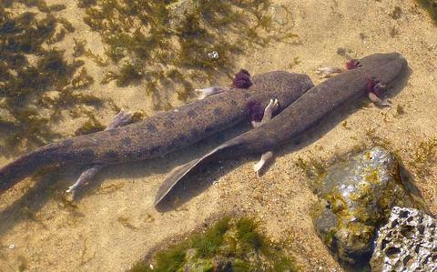

```{r setup, include=FALSE}
knitr::opts_chunk$set(echo = TRUE, 
                      message = FALSE,
                      warning = FALSE)
```

# Learning Objectives: 
- Fetch species observations from the Global Biodiversity Information Facility (GBIF.org) using an R package that wraps a function around their API.
- Fetch environmental data for defining environmental relationship in the species distribution model (SDM).
- Generate pseudo-absences, or background, points with which to differentiate from the species presence points in the SDM.
- Extract underlying environmental data from points.
- Plot term plots of each environmental predictor with the species response.

# Install Packages
```{r}
# load packages, installing if missing
if (!require(librarian)){
  install.packages("librarian")
  library(librarian)
}
librarian::shelf(
  dismo, dplyr, DT, ggplot2, here, htmltools, leaflet, mapview, purrr, raster, readr, rgbif, rgdal, rJava, sdmpredictors, sf, spocc, tidyr)
select <- dplyr::select # overwrite raster::select

# set random seed for reproducibility
set.seed(42)

# directory to store data
dir_data <- here("data")
dir.create(dir_data, showWarnings = F)
```

# Get species observation data for *Necturus maculosus*, the common mudpuppy salamander 



## Retrieve species occurrence data from GBIF 
- retrieve only observations with latitude and longitude coordinates
- there are 1,205 *N. maculosus* observations 
```{r}
obs_csv <- file.path(dir_data, "obs.csv")
obs_geo <- file.path(dir_data, "obs.geojson")

(res <- spocc::occ(
  query = 'Necturus maculosus', 
  from = 'gbif',
  limit = 10000,
  has_coords = T))
```

## Extract and clean data from the GBIF retrieval results 
- keep only *N. maculosus* observation  points 
- remove duplicate observations 
- after cleaning, there are 776 *N. maculosus* observation  points 
```{r}
df <- res$gbif$data[[1]]
df_clean <- df %>% 
  filter(name %in% c("Necturus maculosus (Rafinesque, 1818)", "Necturus maculosus maculosus")) %>% #remove weirdly named points
  filter(longitude < 0) #remove one observation in Europe 
nrow(df_clean)# number of rows

dups2 <- duplicated(df_clean[, c('longitude', 'latitude')])
sum(dups2)
df_clean <- df_clean[!dups2, ]
nrow(df_clean)
```

## Use longitude and latitude to create points of observation and put them in a data frame 
- add CRS 4326 
- map the points 
```{r}
obs <- df_clean %>% 
  sf::st_as_sf(
    coords = c("longitude", "latitude"),
    crs = st_crs(4326))

readr::write_csv(df_clean, obs_csv)
#sf::write_sf(obs, obs_geo)
geojsonio::geojson_write(obs, obs_geo, file = "obs.geojson")

# show points on map
#mapview::mapview(obs, map.types = "Stamen.Watercolor")
```

**Question 1.** How many observations total are in GBIF for your species? 

In total, GBIF contains 1,205 observations of *N. maculosus*.

**Question 2.** Do you see any odd observations, like marine species on land or vice versa? If so, please see the Data Cleaning and explain what you did to fix or remove these points.

Yes, I removed observations with the incorrect species name as well as one outlier observation point located in Europe. I also removed 421 duplicate observations.

# Get Environment Data using `sdmpredictors` 

## Presence 
- retrieve terrestrial environmental data for predicting the niche of the *N. maculosus* observations 
```{r}
dir_env <- file.path(dir_data, "env")

# set a default data directory
options(sdmpredictors_datadir = dir_env)

# choosing terrestrial
env_datasets <- sdmpredictors::list_datasets(terrestrial = TRUE, marine = FALSE)

# show table of datasets
env_datasets %>% 
  select(dataset_code, description, citation) %>% 
  DT::datatable()
```
## View layers from the WorldClim and ENVIREM datasets 
```{r}
# choose datasets for a vector
env_datasets_vec <- c("WorldClim", "ENVIREM")

# get layers
env_layers <- sdmpredictors::list_layers(env_datasets_vec)
DT::datatable(env_layers)
```
## Select appropriate layers 
- WorldClim: 
  - annual mean temperature
  - annual precipitation 
- ENVIREM
  - climatic moisture index
  - topographic wetness 
- map the environmental layers on a global scale 
```{r}
# choose layers after some inspection and perhaps consulting literature
env_layers_vec <- c("WC_bio1", #annual mean temp 
                    "WC_bio12", #annual precipitation 
                    "ER_climaticMoistureIndex", #climatic moisture index 
                    "ER_topoWet") #topographic wetness

# get layers
env_stack <- load_layers(env_layers_vec)

# interactive plot layers, hiding all but first (select others)
mapview(env_stack, hide = T)
```

## Create a convex hull to crop the environmental layers to the area of interest 
```{r}
obs_hull_geo <- file.path(dir_data, "obs_hull.geojson")

# make convex hull around points of observation
obs_hull <- sf::st_convex_hull(st_union(obs))

# show points on map
mapview(list(obs, obs_hull))
```

```{r}
# save obs hull
write_sf(obs_hull, obs_hull_geo)

obs_hull_sp <- sf::as_Spatial(obs_hull)

env_stack <- raster::mask(env_stack, obs_hull_sp) %>% 
  raster::crop(extent(obs_hull_sp))

mapview(obs) + 
  mapview(env_stack, hide = T)
```

# Pseudo-Absence

```{r}
absence_geo <- file.path(dir_data, "absence.geojson")
pts_geo     <- file.path(dir_data, "pts.geojson")
pts_env_csv <- file.path(dir_data, "pts_env.csv")

# get raster count of observations
r_obs <- rasterize(
  sf::as_Spatial(obs), env_stack[[1]], field=1, fun='count')

mapview(obs) + 
  mapview(r_obs)
```
## Create a mask 
```{r}
# create mask for 
r_mask <- mask(env_stack[[1]] > -Inf, r_obs, inverse=T)

absence <- dismo::randomPoints(r_mask, nrow(obs)) %>% 
  as_tibble() %>% 
  st_as_sf(coords = c("x", "y"), crs = 4326)

mapview(obs, col.regions = "green") + 
  mapview(absence, col.regions = "gray")
```
## Combine presence and absence into single set of labeled points
```{r}
pts <- rbind(
  obs %>% 
    mutate(
      present = 1) %>% 
    select(present),
  absence %>% 
    mutate(
      present = 0)) %>% 
  mutate(
    ID = 1:n()) %>% 
  relocate(ID)
write_sf(pts, pts_geo)

# extract raster values for points
pts_env <- raster::extract(env_stack, as_Spatial(pts), df=TRUE) %>% 
  tibble() %>% 
  # join present and geometry columns to raster value results for points
  left_join(
    pts %>% 
      select(ID, present),
    by = "ID") %>% 
  relocate(present, .after = ID) %>% 
  # extract lon, lat as single columns
  mutate(
    #present = factor(present),
    lon = st_coordinates(geometry)[,1],
    lat = st_coordinates(geometry)[,2]) %>% 
  select(-geometry)

write_csv(pts_env, pts_env_csv)
```

# Display a table of data that will feed into the species distribution model 
- Y is the present column where 1 = present and 0 = absent 
- X is all other columns (the environmental layers)
```{r}
pts_env %>% 
  select(-ID) %>% 
  DT::datatable()
```

# Term Plots

```{r}
pts_env %>% 
  select(-ID) %>% 
  mutate(
    present = factor(present)) %>% 
  pivot_longer(-present) %>% 
  ggplot() +
  geom_density(aes(x = value, fill = present)) + 
  scale_fill_manual(values = alpha(c("gray", "green"), 0.5)) +
  scale_x_continuous(expand=c(0,0)) +
  scale_y_continuous(expand=c(0,0)) +
  theme_bw() + 
  facet_wrap(~name, scales = "free") +
  theme(
    legend.position = c(1, 0),
    legend.justification = c(1, 0))
```
