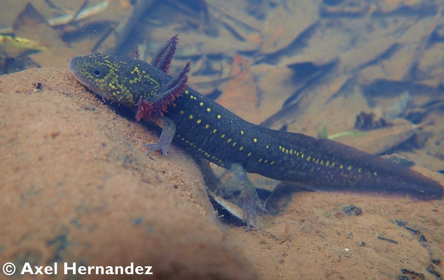

# Learning Objectives:

## Lab 1a - Explore

-   Fetch species observations from the Global Biodiversity Information Facility (GBIF.org) using an R package that wraps a function around their API.
-   Fetch environmental data for defining environmental relationship in the species distribution model (SDM).
-   Generate pseudo-absences, or background, points with which to differentiate from the species presence points in the SDM.
-   Extract underlying environmental data from points.
-   Plot term plots of each environmental predictor with the species response.

## Lab 1b - Logistic Regression

-   Pairs plot to show correlation between variables and avoid multicollinearity (see 8.2 Many predictors in a model) Logistic Regression seen as an evolution of techniques
-   Linear Model to show simplest multivariate regression, but predictions can be outside the binary values.
-   Generalized Linear Model uses a logit transformation to constrain the outputs to being within two values.
-   Generalized Additive Model allows for "wiggle" in predictor terms.
-   Maxent (Maximum Entropy) is a presence-only modeling technique that allows for a more complex set of shapes between predictor and response.

## Lab 1c - Decision Trees

-   explore Supervised Classification for categorical values

    -   this is considered a Classification, while Supervised Classification for continuous values is called a Regression

-   use Decision Trees as a Classification technique to classify categorical species presence and absence data

    -   specifically, use Recursive Partitioning and Random Forest techniques

## Lab 1d - Evaluate the model

-   Evaluate model performance
-   Calibrate model parameters

```{r setup, include=FALSE}
knitr::opts_chunk$set(echo = TRUE,
                      message = FALSE, 
                      warning = FALSE, 
                      include = TRUE)
```

# Set up

```{r}
# load packages, installing if missing
if (!require(librarian)){
  install.packages("librarian")
  library(librarian)
}
#librarian::lib_paths("/Users/bbest/R/x86_64-pc-linux-gnu-library/4.0")

librarian::shelf(
  dismo, dplyr, DT, ggplot2, here, htmltools, leaflet, mapview, purrr, raster, readr, rgbif, rgdal, rJava, sdmpredictors, sf, spocc, tidyr)
select <- dplyr::select # overwrite raster::select

# set random seed for reproducibility
set.seed(42)

# directory to store data
dir_data <- here("data")
dir.create(dir_data, showWarnings = F)
```

# Get species observation data for *Necturus maculosus*, the common mudpuppy salamander from GBIF


## Retrieve species occurrence data from GBIF

-   retrieve only observations with latitude and longitude coordinates

-   there are 1,205 *N. maculosus* observations in total

-   Extract and clean data from the GBIF retrieval results

    -   keep only *N. maculosus* observation points
    -   keep only relevant column information
    -   remove duplicate observations
    -   after cleaning, there are 776 *N. maculosus* observation points

-   Use longitude and latitude to create points of observation and put them in a data frame

    -   add CRS 4326

    ```{r}
    obs_csv <- file.path(dir_data, "obs.csv")
    obs_geo <- file.path(dir_data, "obs.geojson")
    redo    <- FALSE

    if (!file.exists(obs_geo) | redo){
      (res <- spocc::occ(
        query = 'Necturus maculosus',
        from = 'gbif',
        limit = 10000,
        has_coords = T))

      # extract data frame from result
      df <- res$gbif$data[[1]]
      
      #clean the data 
      df_clean <- df %>% 
      filter(name %in% c("Necturus maculosus (Rafinesque, 1818)", "Necturus maculosus maculosus")) %>% #remove weirdly named points
      filter(longitude < 0) %>% #remove one observation in Europe 
      select(c("name", "longitude", "latitude", "key", "lifeStage", "stateProvince", "year"))
      
      #remove duplicates 
      dups2 <- duplicated(df_clean[, c('longitude', 'latitude')])
      sum(dups2)
      df_clean <- df_clean[!dups2, ]
      
      readr::write_csv(df_clean, obs_csv)

      # convert to points of observation from lon/lat columns in data frame
      obs <- df_clean %>%
        sf::st_as_sf(
          coords = c("longitude", "latitude"),
          crs = st_crs(4326))
      
      sf::write_sf(obs, obs_geo, delete_dsn=T)
    }

    obs <- sf::read_sf(obs_geo)
    nrow(obs) # number of rows
    ```

## Map the distribution of points

```{r}
mapview::mapview(obs, map.types = "Stamen.Watercolor")
```

**Question 1.** How many observations total are in GBIF for your species?

In total, GBIF contains 1,205 observations of *N. maculosus*.

**Question 2.** Do you see any odd observations, like marine species on land or vice versa? If so, please see the Data Cleaning and explain what you did to fix or remove these points.

Yes, I removed observations with the incorrect species name as well as one outlier observation point located in Europe. I also removed 421 duplicate observations.

# Get Environment Data using `sdmpredictors`

## Presence

-   retrieve terrestrial environmental data for predicting the niche of the *N. maculosus* observations

```{r}
dir_env <- file.path(dir_data, "env")

# set a default data directory
options(sdmpredictors_datadir = dir_env)

# choosing terrestrial
env_datasets <- sdmpredictors::list_datasets(terrestrial = TRUE, marine = FALSE)

# show table of datasets
env_datasets %>% 
  select(dataset_code, description, citation) %>% 
  DT::datatable()
```

## View layers from the WorldClim and ENVIREM datasets

```{r}
# choose datasets for a vector
env_datasets_vec <- c("WorldClim", "ENVIREM")

# get layers
env_layers <- sdmpredictors::list_layers(env_datasets_vec)
DT::datatable(env_layers)
```

## Select appropriate layers

Prior work suggests that *N. maculosus* species distribution is most influenced by environmental variables not related to climate such as urban development, agriculture, tree canopy cover, and road density ([Fischer 2020](https://scholarworks.iupui.edu/handle/1805/22884)). However, other aquatic salamander species such as *Ambystoma ordinarium*, a mole salamander from Mexico, have been shown to be best predicted by WorldClim variables ([Escalera-Vásquez et al. 2018](https://doi.org/10.1655/Herpetologica-D-16-00078.1)). Furthermore, as ectotherms, salamanders are known to be sensitive to both temperature and moisture shifts ([McEntire and Maerz 2019](https://www.frontiersin.org/articles/10.3389/fevo.2019.00022/full)).



-   WorldClim:

    -   altitude
    -   annual mean temperature
    -   mean diurnal temperature range
    -   temperature seasonality
    -   minimum temperature of the coldest month
    -   annual precipitation
    -   precipitation of the driest month

-   ENVIREM

    -   climatic moisture index
    -   terrain roughness index
    -   topographic wetness

-   map the environmental layers on a global scale

```{r}
# choose layers after some inspection and perhaps consulting literature
env_layers_vec <- c("WC_alt", #altitude 
                    "WC_bio1", #annual mean temp 
                    "WC_bio2", #mean diurnal temp range 
                    "WC_bio4", #temperature seasonality 
                    "WC_bio6", #minimum temperature of the coldest month 
                    "WC_bio12", #annual precipitation 
                    "WC_bio14", #precipitation of the driest month 
                    "ER_climaticMoistureIndex", #climatic moisture index 
                    "ER_tri", #terrain roughness index 
                    "ER_topoWet") #topographic wetness

# get layers
env_stack <- load_layers(env_layers_vec)

# interactive plot layers, hiding all but first (select others)
mapview(env_stack, hide = T)
```

## Create a convex hull to crop the environmental layers to the area of interest

-   map the convex hull

```{r}
obs_hull_geo  <- file.path(dir_data, "obs_hull.geojson")
env_stack_grd <- file.path(dir_data, "env_stack.grd")

if (!file.exists(obs_hull_geo) | redo){
  # make convex hull around points of observation
  obs_hull <- sf::st_convex_hull(st_union(obs))
  
  # save obs hull
  write_sf(obs_hull, obs_hull_geo)
}
obs_hull <- read_sf(obs_hull_geo)

mapview(list(obs, obs_hull))
```

## Create and map the environmental raster

```{r}
if (!file.exists(env_stack_grd) | redo){
  obs_hull_sp <- sf::as_Spatial(obs_hull)
  env_stack <- raster::mask(env_stack, obs_hull_sp) %>% 
    raster::crop(extent(obs_hull_sp))
  writeRaster(env_stack, env_stack_grd, overwrite=T)  
}
env_stack <- stack(env_stack_grd)

# show map
# mapview(obs) + 
#   mapview(env_stack, hide = T) # makes html too big for Github
plot(env_stack, nc=2)
```

# Pseudo-Absence

-   count observations in the raster
-   create a mask
-   generate random pseudo-absence points inside the mask
-   map the presence and pseudo-absence points

```{r}
absence_geo <- file.path(dir_data, "absence.geojson")
pts_geo     <- file.path(dir_data, "pts.geojson")
pts_env_csv <- file.path(dir_data, "pts_env.csv")

# # get raster count of observations
# r_obs <- rasterize(
#   sf::as_Spatial(obs), env_stack[[1]], field=1, fun='count')
# 
# mapview(obs) + 
#   mapview(r_obs)

if (!file.exists(absence_geo) | redo){
  # get raster count of observations
  r_obs <- rasterize(
    sf::as_Spatial(obs), env_stack[[1]], field=1, fun='count')
  
  # show map
  # mapview(obs) + 
  #   mapview(r_obs)
  
  # create mask for 
  r_mask <- mask(env_stack[[1]] > -Inf, r_obs, inverse=T)
  
  # generate random points inside mask
  absence <- dismo::randomPoints(r_mask, nrow(obs)) %>% 
    as_tibble() %>% 
    st_as_sf(coords = c("x", "y"), crs = 4326)
  
  write_sf(absence, absence_geo, delete_dsn=T)
}
absence <- read_sf(absence_geo)

# show map of presence, ie obs, and absence
mapview(obs, col.regions = "green") + 
  mapview(absence, col.regions = "gray")
```

## Combine presence and absence into single set of labeled points

-   display a table of all labeled data points that will feed into the species distribution model

    -   Y is the present column where 1 = present and 0 = absent
    -   X is all other columns (the environmental layers)

    ```{r}
    if (!file.exists(pts_env_csv) | redo){

      # combine presence and absence into single set of labeled points 
      pts <- rbind(
        obs %>% 
          mutate(
            present = 1) %>% 
          select(present, key),
        absence %>% 
          mutate(
            present = 0,
            key     = NA)) %>% 
        mutate(
          ID = 1:n()) %>% 
        relocate(ID)
      write_sf(pts, pts_geo, delete_dsn=T)

      # extract raster values for points
      pts_env <- raster::extract(env_stack, as_Spatial(pts), df=TRUE) %>% 
        tibble() %>% 
        # join present and geometry columns to raster value results for points
        left_join(
          pts %>% 
            select(ID, present),
          by = "ID") %>% 
        relocate(present, .after = ID) %>% 
        # extract lon, lat as single columns
        mutate(
          #present = factor(present),
          lon = st_coordinates(geometry)[,1],
          lat = st_coordinates(geometry)[,2]) %>% 
        select(-geometry)
      write_csv(pts_env, pts_env_csv)
    }
    pts_env <- read_csv(pts_env_csv)

    pts_env %>% 
      # show first 10 presence, last 10 absence
      slice(c(1:10, (nrow(pts_env)-9):nrow(pts_env))) %>% 
      DT::datatable(
        rownames = F,
        options = list(
          dom = "t",
          pageLength = 20))
    ```

# Term Plots

-   density histogram where density is on the y axis

```{r}
pts_env %>% 
  select(-ID) %>% 
  mutate(
    present = factor(present)) %>% 
  pivot_longer(-present) %>% 
  ggplot() +
  geom_density(aes(x = value, fill = present)) + 
  scale_fill_manual(values = alpha(c("gray", "green"), 0.5)) +
  scale_x_continuous(expand=c(0,0)) +
  scale_y_continuous(expand=c(0,0)) +
  theme_bw() + 
  facet_wrap(~name, scales = "free") +
  theme(
    legend.position = c(1, 0),
    legend.justification = c(1, 0))
```
